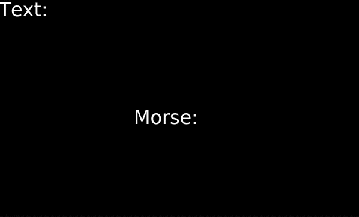

# Morse Decoder

A small SDL2 desktop application that decodes Morse code in real time from a single input: how long you hold down the spacebar.



## Features

- Dot (`.`) / dash (`-`) detection based on key hold duration
- Automatic letter decoding after a pause
- Supports A-Z and 0-9
- On-screen display of both the raw Morse input and the decoded text
- One-key reset

## How It Works

The duration you hold the spacebar down determines which symbol is registered:

| Hold duration | Symbol |
|---|---|
| 100 ms – 400 ms | Dot (`.`) |
| 400 ms – 900 ms | Dash (`-`) |
| Shorter than 100 ms or longer than 900 ms | Ignored |

After a symbol is entered, if no new symbol is entered within **2 seconds**, the accumulated Morse code is decoded into a letter, appended to the on-screen text, and the input buffer is cleared.

## Controls

| Key | Action |
|---|---|
| `Space` | Enter a dot or dash, depending on how long it's held |
| `R` | Reset the current Morse input and decoded text |
| Close window | Quit the application |

## Requirements

- A C++20-capable compiler
- CMake 3.16+
- SDL2
- SDL2_ttf

## Build

```bash
git clone https://github.com/ataataataataata/morse-decoder.git
cd morse-decoder

cmake -B build
cmake --build build
```

The `assets` folder (including fonts) is copied next to the built executable automatically as part of the build.

## Run

```bash
./build/MorseDecoder
```

## Usage

1. Launch the app — a `1200x720` window will open.
2. Tap the spacebar with a short or long press to enter a dot or dash.
3. Pause for 2 seconds to have the current input decoded into a letter and appended to the text.
4. Press `R` at any time to clear everything and start over.

## Project Structure

```
morse-decoder/
├── assets/fonts/       # Font used for rendering text (DejaVu Sans)
├── include/            # Header files
├── src/                # Source files
│   ├── main.cpp
│   ├── Application.cpp
│   ├── Window.cpp
│   ├── Renderer.cpp
│   ├── MorseInput.cpp
│   └── MorseTranslator.cpp
└── CMakeLists.txt
```

## Known Limitations

- No support for word spacing — only individual letters are decoded.
- No support for punctuation.

## License

Licensed under the [MIT License](LICENSE).